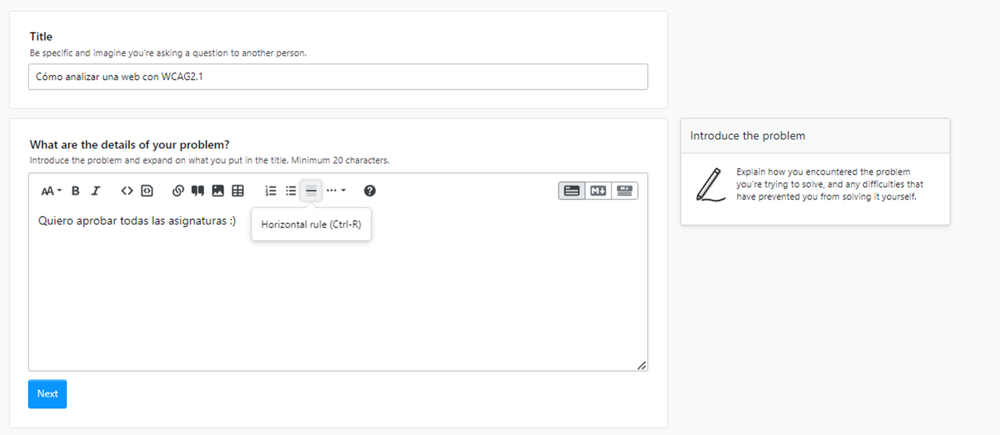
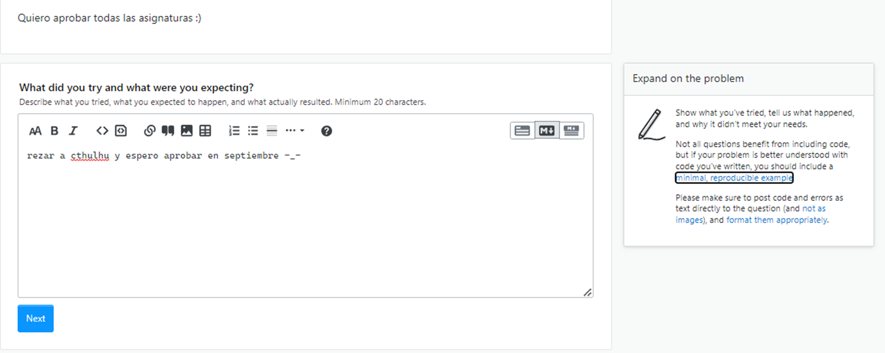
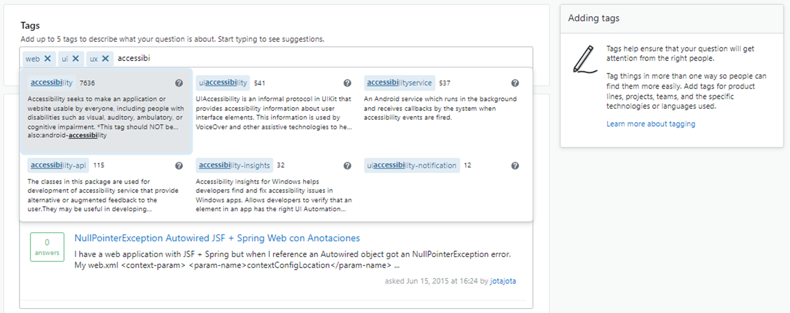
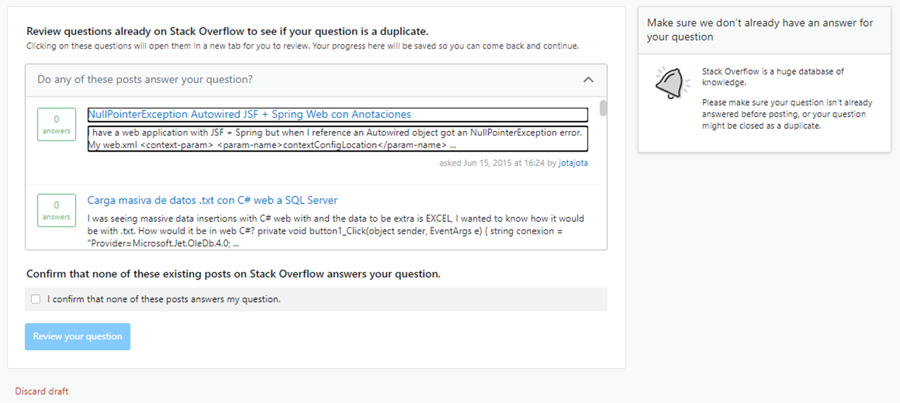

# Formulario Foros UNED y StackOverflow

Quiero centrar mi análisis en un formulario de gran importancia para nosotros. El formulario para publicar los mensajes en el foro de cualquier asignatura. Es realmente un formulario simple, pero voy a compararlos con el formulario de otra web de suma importancia para cualquier informático, stackoverflow.

 Y es que el formulario de la UNED solo tiene un título, dos botones para citar y adjuntar que no son accesibles mediante teclado; y un editor de texto WYSIWYG que solo permite dos opciones mediante teclado. Un editor aparentemente muy completo, pero en el que solo puedo usar **Ctrl+B** o *Ctrl+I*. Comparemos este editor con el que nos proporciona Stackoverflow.

Nota: usando el ratón he podido ver que hay un par de atajos más, pero solo con el teclado no he podido descubrirlos.

Nos podemos desplazar del campo título al cuerpo con el tabulador y directamente nos posiciona en el textarea para que empecemos a escribir el mensaje. Sin embargo, la primera gran diferencia es que, si queremos hacer uso de alguna de las opciones que se muestran en la barra superior, solo tenemos que hacer Mayus+Tab para retroceder y movernos por la barra. 

Nota: Mencionar que es un poco pesado recorrer toda la barra para retroceder al campo anterior, pero es comprensible. 

Lo primero que nos encontramos en la barra son las opciones de visualización que podemos alternar con los botones izquierda y derecha. A continuación, cada opción muestra un tooltip con la descripción de la acción y el atajo de teclado. Además de poder activarse con el Enter, cada opción tiene su propio atajo.

En el siguiente apartado, vemos como el cartel lateral no solo muestra algunos consejos, si que nos da enlaces accesibles mediante tabulación. Sin embargo, aquí he de señalar un fallo. Y es que los enlaces se abren por defecto en la misma pestaña y encima al regresar has perdido lo escrito. Como voy a saber que tengo que usar Ctrl o Mayus + Enter.

En el siguiente campo debemos poner 5 etiquetas y es bastante intuitivo, al escribir una coma automáticamente se formatea como se ve. Y si te mueves con las flechas se puede editar la etiqueta sin problemas. Además, muestra opciones de autocompletado que son navegables mediante flechas.
En conclusión, el foro de la UNED necesita una actualización en cuanto a accesibilidad, aunque me consta que el campus ya se está moviendo hacia una nueva plataforma.

Finalmente nos muestra una serie de sugerencias de artículos similares navegable mediante flecha o TAB, cuyo punto débil es que hay que recorrerla entera para poder confirmar y enviar el mensaje. Aunque decir que aquí los enlaces si se abren en otra ventana (propiedad blank).
